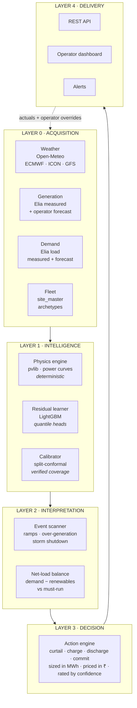
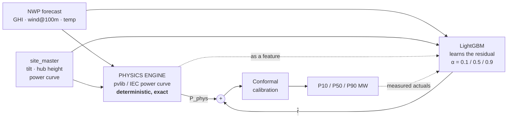
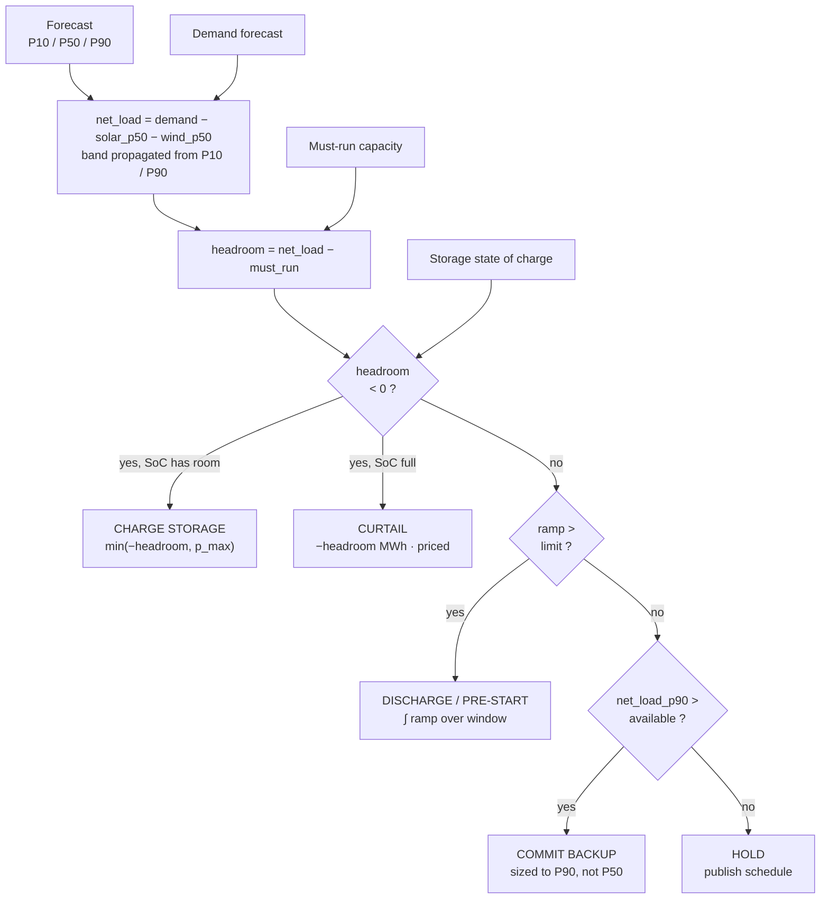
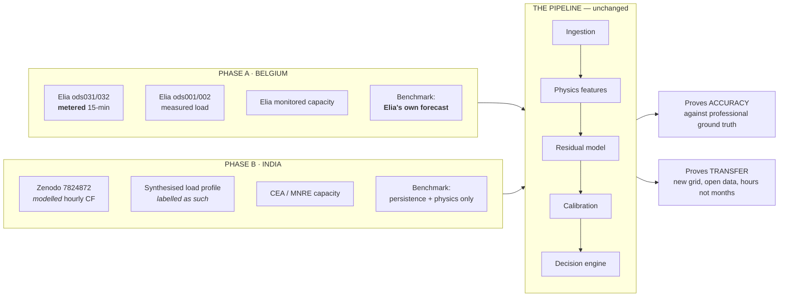
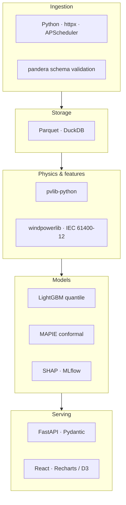
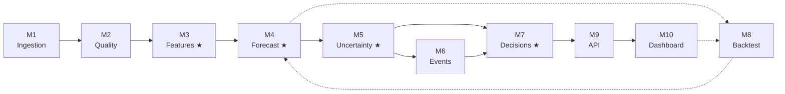

# High-Level System Architecture

> The conceptual view. Use this for slides and the 60-second explanation. Component-level detail is in [`06-system-architecture.md`](06-system-architecture.md).

---

## 1. The system in one sentence

**Weather forecasts and fleet parameters go in; sized, priced, confidence-rated grid actions come out — with a physics engine doing the deterministic work and machine learning correcting only what physics gets wrong.**

---

## 2. Five-layer view

| Layer | Question it answers | Output |
|---|---|---|
| **0 · Acquisition** | What do we know? | Validated, time-aligned, unit-normalised records |
| **1 · Intelligence** | What will be generated? | P10 / P50 / P90 MW per region per hour, 72 h ahead |
| **2 · Interpretation** | What does that mean for the grid? | Flagged events and net-load balance with bands |
| **3 · Decision** | What should be done about it? | Ranked actions, sized and priced |
| **4 · Delivery** | How does a human act on it? | API, dashboard, alerts |

The feedback arrow is what makes this a platform rather than a notebook: measured actuals retrain the residual model nightly and recalibrate the intervals, and operator decisions become labelled data.

---

## 3. The core mechanism — physics plus residual

This is the single diagram worth memorising. It is what distinguishes this design.

**Why it works.** A solar plant's output at 11:00 on 14 March is roughly 90 % determined by orbital mechanics, panel geometry and clear-sky radiative transfer — all computable exactly, today, with no training data. The physics engine does that. The boosted model never has to learn it; it sees only the leftover: soiling, wake losses, sensor drift, local microclimate, archetype mis-weighting.

**What this buys:**

| Property | Consequence |
|---|---|
| **Low data requirement** | The residual is small and structured; the raw signal is large and seasonal |
| **Cold start** | A region with zero history still gets a physics forecast on day one |
| **Interpretability** | SHAP on the residual says "low cloud and soiling", not an opaque 300-feature attribution |
| **Graceful degradation** | If the ML model drifts or fails, the system falls back to physics, not to nothing |
| **Transferability** | Moving to a new region changes `site_master` and grid points — not the model architecture |

---

## 4. Forecast to action

Two properties make an output a recommendation rather than an `if` statement:

- **Every action carries a number** — "charge 42 MWh between 11:00 and 14:00, avoiding approximately ₹1.8 lakh of curtailment at today's imbalance price", with the price assumption stated.
- **Every action carries its confidence** — an action triggered by a P50 inside a wide band is a *suggestion*; one where the whole band clears the threshold is a *decision*. The interface distinguishes them.

---

## 5. Two-region transfer

Nothing in the pipeline changes between regions. Only three inputs are swapped — which is itself the demonstration.

| | Phase A — Belgium | Phase B — India |
|---|---|---|
| **Truth** | Metered, 15-minute | Reanalysis-modelled, hourly |
| **Demand** | Measured + forecast | Synthesised, labelled |
| **Benchmark** | Elia's published day-ahead forecast | Persistence and physics only |
| **What it proves** | The model is competitive with a professional operational system | The pipeline transfers to a new grid on open data alone |

> **Stated before anyone asks:** scoring a model against modelled data partly scores the model that produced it. Phase B validates **transferability, not accuracy**. Belgium carries the accuracy claim.

---

## 6. Technology stack

| Layer | Choice | Why |
|---|---|---|
| Ingestion | Python, `httpx`, APScheduler | Adequate at this scale; no orchestration overhead |
| Validation | `pandera` | Declarative contracts that fail loudly at layer boundaries |
| Storage | Parquet + DuckDB | Columnar, fast, zero-ops. Postgres/TimescaleDB **[PLANNED]** for production. |
| Solar physics | `pvlib-python` | Peer-reviewed reference implementation |
| Wind physics | `windpowerlib` + IEC normalisation | Standard shear and power-curve handling |
| Models | LightGBM | Seconds to train, handles missing values, SHAP-explainable |
| Calibration | MAPIE / split-conformal | Distribution-free finite-sample coverage guarantee |
| Tracking | MLflow | Experiment and model-version registry |
| API | FastAPI + Pydantic | Typed contracts, automatic OpenAPI docs |
| Dashboard | React + Recharts/D3 | Fan charts, net-load stacks, event timelines |
| Deployment | Docker Compose | Reproducible; scales without rewrite |

**Entirely open source. No licence cost and no vendor dependency anywhere in the critical path.** The whole system trains and serves on a laptop — no GPU required — which means it can be deployed at a load dispatch centre without a procurement cycle.

---

## 7. Module map

★ = critical path

| Module | Responsibility | Stack |
|---|---|---|
| **M1** Ingestion | Source adapters, scheduling, unit and timezone normalisation | httpx, APScheduler |
| **M2** Quality | Range checks, frozen-sensor detection, gap filling, curtailment masking | pandera, numpy |
| **M3** Features ★ | Physics layer — pvlib chain, shear, density correction, power curves, cyclic encoding | pvlib, windpowerlib |
| **M4** Forecast ★ | Baselines, physics model, residual GBDT, multi-horizon, model registry | LightGBM, MLflow |
| **M5** Uncertainty ★ | Quantile heads, conformal calibration, coverage reporting | LightGBM, MAPIE |
| **M6** Events | Ramp, over-generation and storm-shutdown detection with lead time | scipy.signal |
| **M7** Decisions ★ | Net-load balance, storage simulation, ranked and priced actions | pandas, PuLP **[STRETCH]** |
| **M8** Backtest | Walk-forward evaluation, skill scores, drift detection, SHAP | MLflow, SHAP |
| **M9** API | `/forecast`, `/outlook`, `/events`, `/actions`, `/backtest` | FastAPI |
| **M10** Dashboard | Fan chart, net-load stack, event timeline, action queue, regional map | React, D3 |

---

## 8. Design principles

| Principle | How it shows up |
|---|---|
| **Physics where physics is exact** | Deterministic geometry and radiative transfer are computed, not learned |
| **One feature path, two consumers** | Training and inference call identical code — the standard cause of demo-day failure, removed structurally |
| **Every forecast is an interval, and the interval is verified** | Conformal calibration with a published coverage plot |
| **Fail loudly at boundaries** | Schema validation between every layer; bad data never propagates silently |
| **Configuration over code** | Regions, archetypes, thresholds and storage parameters live in YAML |
| **The output is a decision** | Sized in MWh, priced, and rated by confidence |
| **State limitations first** | Assumptions marked, caveats named before anyone asks |

---

## 9. The 60-second version

> Solar and wind output swings with the weather, and grid operators cover that uncertainty by holding inflexible fossil generation in reserve — or by curtailing renewables outright. India curtailed 2.1 TWh last financial year, and from 1 April 2026 the permitted forecast deviation for solar was halved to ± 5 %.
>
> We forecast regional solar and wind output 24 to 72 hours ahead. The key idea is that most of the answer is physics, not learning — panel geometry, sun position and clear-sky radiative transfer are exactly computable, so we compute them and let a gradient-boosting model correct only the residual. That means we need far less training data, and a region with no generation history still gets a usable forecast on day one.
>
> Every forecast is an interval, and we calibrate the interval so the 80 % band demonstrably covers 80 % of outcomes — because an operator sizing reserves needs a number they can trust, not a point estimate.
>
> Then we convert the forecast into an action: this Tuesday between 11:00 and 14:00 the region is 340 MW over-generating with 80 % confidence; charging the battery absorbs 210 MWh of it; the remaining 130 MWh must be curtailed at a cost of ₹X.
>
> We validate against Belgium, where metered data and the grid operator's own published forecast both exist, so our accuracy claim is measured against a professional system rather than a baseline we chose ourselves. Then we transfer the same pipeline to Indian data to show it moves to a new grid in hours.
