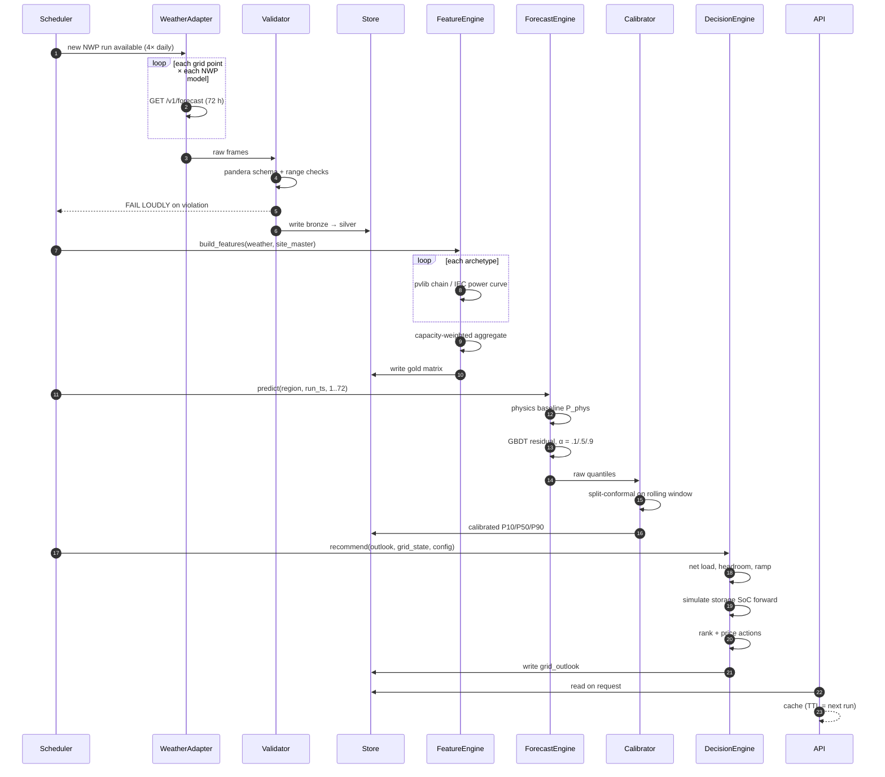
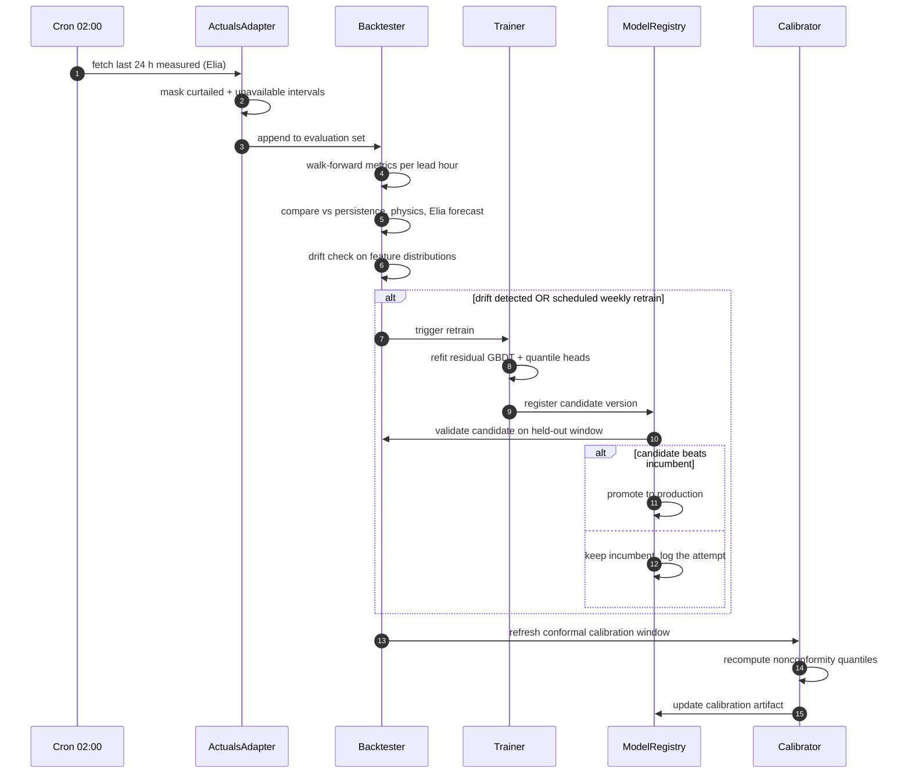
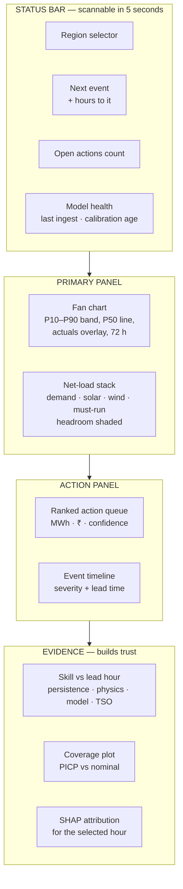
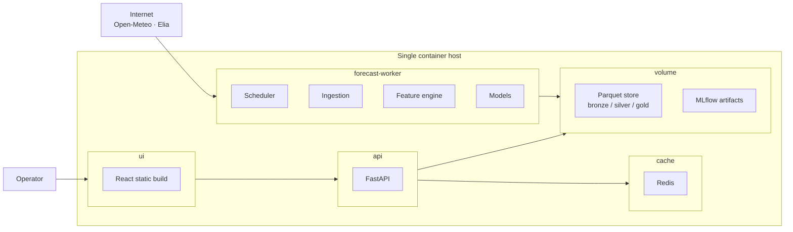

# System Architecture

> Component-level design, interface contracts, schemas, API surface and deployment. The conceptual view is in [`05-high-level-architecture.md`](05-high-level-architecture.md).

---

## 1. Component architecture

```mermaid
flowchart TB
    subgraph EXT["EXTERNAL SOURCES"]
        X1["Open-Meteo<br/>Forecast + Historical API"]
        X2["Elia Open Data<br/>ods031/032/086/087"]
        X3["Elia Load<br/>ods001/002/003"]
        X4["Zenodo 7824872<br/>India CF"]
    end

    subgraph M1["M1 · INGESTION"]
        I1["WeatherAdapter"]
        I2["GenerationAdapter"]
        I3["LoadAdapter"]
        I4["Scheduler<br/>APScheduler"]
    end

    subgraph M2["M2 · QUALITY"]
        Q1["Schema validation<br/>pandera"]
        Q2["Range + frozen-sensor checks"]
        Q3["Curtailment detector"]
        Q4["Gap imputation"]
    end

    subgraph STORE["STORAGE · Parquet + DuckDB"]
        S1["bronze/<br/>raw, as fetched"]
        S2["silver/<br/>validated, typed"]
        S3["gold/<br/>model matrix"]
    end

    subgraph M3["M3 · FEATURE ENGINE"]
        F1["SolarPhysics<br/>pvlib"]
        F2["WindPhysics<br/>IEC 61400-12"]
        F3["ArchetypeAggregator<br/>capacity-weighted"]
        F4["TemporalEncoder"]
        F5["NWPQualityFeatures"]
    end

    subgraph M4["M4 · FORECAST"]
        P1["PersistenceModel"]
        P2["PhysicsModel"]
        P3["ResidualGBDT<br/>LightGBM"]
        P4["ModelRegistry<br/>MLflow"]
    end

    subgraph M5["M5 · UNCERTAINTY"]
        U1["QuantileHeads<br/>α = .1 / .5 / .9"]
        U2["ConformalCalibrator"]
        U3["CoverageReporter"]
    end

    subgraph M6M7["M6 · EVENTS + M7 · DECISIONS"]
        D1["EventScanner"]
        D2["NetLoadBalancer"]
        D3["StorageSimulator"]
        D4["ActionRanker"]
    end

    subgraph M9["M9 · API"]
        A1["FastAPI"]
        A2["Redis cache"]
    end

    subgraph M10["M10 · UI"]
        V1["React dashboard"]
    end

    M8["M8 · BACKTEST & MONITOR<br/>walk-forward · skill scores · SHAP · drift"]

    EXT --> M1 --> M2
    M2 --> S1 --> S2 --> S3
    S3 --> M3 --> M4 --> M5 --> M6M7 --> M9 --> M10
    M4 -.-> M8
    M5 -.-> M8
    M8 -.->|"nightly retrain trigger"| M4
    S2 -.->|"actuals"| M8
    M10 -.->|"operator overrides logged"| S1
```



---

## 2. Interface contracts

**Fix these three signatures on day one.** Everything else is implementation detail behind them, and fixing them is what allows parallel work without collisions.

```python
# ── M3 ────────────────────────────────────────────────────────────
def build_features(
    weather: pd.DataFrame,        # Layer-0 weather_nwp
    site: SiteMaster,             # one archetype row
    actuals: pd.DataFrame | None = None,   # for lag features; None at cold start
) -> pd.DataFrame:
    """Pure function. Identical code path for training and inference.
    Index: (run_ts_utc, valid_ts_utc). No I/O, no global state."""


# ── M4 + M5 ───────────────────────────────────────────────────────
def predict(
    region_id: str,
    run_ts: pd.Timestamp,
    horizons: range = range(1, 73),
    quantiles: tuple = (0.1, 0.5, 0.9),
) -> pd.DataFrame:
    """Returns one row per (valid_ts, tech) with columns
    p10_mw, p50_mw, p90_mw, model_version, calibrated: bool."""


# ── M7 ────────────────────────────────────────────────────────────
def recommend(
    outlook: pd.DataFrame,        # forecast quantiles + demand
    grid_state: GridState,        # must_run, storage SoC, ramp limits
    config: RegionConfig,         # thresholds, prices
) -> pd.DataFrame:
    """Returns ranked actions: action, mwh, value_inr,
    confidence, rationale, valid_from, valid_to."""
```

**Why `build_features` being a pure function matters.** The most common production failure in forecasting systems is training and serving computing features differently — a subtly different fill rule, a different timezone, a lag computed from a different origin. Making it one pure function with no I/O removes that class of bug structurally rather than by discipline.

---

## 3. Data contracts

Each layer boundary is validated by a `pandera` schema. Bad data fails loudly at the boundary instead of propagating silently.

```python
weather_nwp_schema = DataFrameSchema({
    "run_ts_utc":       Column(pa.DateTime, nullable=False),
    "valid_ts_utc":     Column(pa.DateTime, nullable=False),
    "lead_hours":       Column(pa.Int,   Check.in_range(0, 168)),
    "nwp_model":        Column(pa.String, Check.isin(["ecmwf_ifs","icon","gfs"])),
    "grid_point_id":    Column(pa.String, nullable=False),
    "weight":           Column(pa.Float, Check.in_range(0, 1)),
    "ghi_wm2":          Column(pa.Float, Check.in_range(0, 1400), nullable=True),
    "dni_wm2":          Column(pa.Float, Check.in_range(0, 1100), nullable=True),
    "dhi_wm2":          Column(pa.Float, Check.in_range(0,  700), nullable=True),
    "temperature_2m_c": Column(pa.Float, Check.in_range(-60, 60)),
    "wind_speed_100m_ms": Column(pa.Float, Check.in_range(0, 90)),
    "cloud_cover_pct":  Column(pa.Float, Check.in_range(0, 100)),
}, unique=["run_ts_utc","valid_ts_utc","nwp_model","grid_point_id"])
```

The `unique` constraint on `(run_ts_utc, valid_ts_utc, nwp_model, grid_point_id)` is the guard against the single most damaging silent bug in this domain: **overwriting a 48-hour-old forecast with a 6-hour-old one**, which makes every subsequent backtest cheat.

```python
generation_actuals_schema = DataFrameSchema({
    "region_id":             Column(pa.String),
    "ts_utc":                Column(pa.DateTime),
    "tech":                  Column(pa.String, Check.isin(["solar","wind"])),
    "power_mw":              Column(pa.Float, Check.ge(0)),
    "monitored_capacity_mw": Column(pa.Float, Check.gt(0)),
    "curtailed_mw":          Column(pa.Float, Check.ge(0), nullable=True),
    "qc_flag":               Column(pa.String, Check.isin(
        ["OK","MISSING","FROZEN","OUT_OF_RANGE","CURTAILED"])),
}, checks=Check(lambda df: df["power_mw"] <= df["monitored_capacity_mw"] * 1.05,
                error="power exceeds monitored capacity"))
```

---

## 4. Configuration

Regions, archetypes, thresholds and storage are configuration, never code.

```yaml
# config/regions/belgium.yaml
region_id: BE
timezone: Europe/Brussels
resolution_min: 15

weather_grid:                      # capacity-weighted sample points
  - {lat: 51.05, lon: 3.72,  weight: 0.30}   # Flanders west
  - {lat: 51.22, lon: 4.40,  weight: 0.25}   # Antwerp
  - {lat: 50.85, lon: 4.35,  weight: 0.15}   # Brussels
  - {lat: 50.63, lon: 5.57,  weight: 0.18}   # Liège
  - {lat: 50.46, lon: 4.87,  weight: 0.12}   # Namur
nwp_models: [ecmwf_ifs, icon, gfs]

archetypes:
  solar:
    - {id: rooftop_south,    tilt: 35, azimuth: 180, share: 0.45,
       dc_ac_ratio: 1.15, gamma_pdc: -0.0035, tracking: fixed}
    - {id: rooftop_east_west, tilt: 20, azimuth:  90, share: 0.30,
       dc_ac_ratio: 1.15, gamma_pdc: -0.0035, tracking: fixed}
    - {id: ground_mount,     tilt: 30, azimuth: 180, share: 0.25,
       dc_ac_ratio: 1.25, gamma_pdc: -0.0035, tracking: fixed}
  wind:
    - {id: onshore,  hub_height_m:  95, cut_in_ms: 3, rated_ms: 12,
       cut_out_ms: 25, shear_alpha: 0.20, wake_loss_frac: 0.08, share: 0.55}
    - {id: offshore, hub_height_m: 140, cut_in_ms: 3, rated_ms: 13,
       cut_out_ms: 27, shear_alpha: 0.11, wake_loss_frac: 0.12, share: 0.45}

decision_thresholds:
  ramp_limit_mw_per_h: 400
  band_limit_frac: 0.35            # p90−p10 above this ⇒ LOW_CONFIDENCE
  must_run_mw: 2800

storage:
  energy_capacity_mwh: 400
  power_rating_mw: 100
  round_trip_efficiency: 0.88
  soc_min_frac: 0.10
  soc_max_frac: 0.95
  degradation_per_cycle: 0.00003
  response_time_min: 5

prices:
  curtailment_opportunity_cost_per_mwh: 3000    # INR — stated assumption
  backup_fuel_cost_per_mwh: 6500
```

Archetype `share` values start as assumptions and are refined by the clear-sky fitting procedure (§4.4 of the technical approach). Moving to a new region is a new YAML file, not new code — which is what makes the Belgium → India transfer a configuration change.

---

## 5. Forecast generation sequence



---

## 6. Nightly retraining



**The candidate-must-beat-incumbent gate matters.** Automatic retraining without a promotion gate is how production models silently degrade — a bad data day produces a bad model that is deployed without review.

---

## 7. API surface

| Endpoint | Method | Returns |
|---|---|---|
| `/forecast` | GET | P10/P50/P90 per hour per technology. Params: `region_id`, `run_ts`, `horizon_hours`, `tech` |
| `/outlook` | GET | Net-load balance with propagated bands, headroom, ramp |
| `/events` | GET | Detected ramps, over-generation windows, storm shutdowns, with severity and lead time |
| `/actions` | GET | Ranked recommendations, sized in MWh, priced, with confidence and rationale |
| `/storage/sweep` | GET | Curtailment-avoided vs battery-size curve for the region |
| `/backtest` | GET | Metrics per lead hour vs persistence, physics and operator forecast |
| `/sites` | GET | Configured regions and archetypes |
| `/health` | GET | Last successful ingest, model version, calibration age |

Every response carries provenance:

```json
{
  "region_id": "BE",
  "issued_at": "2026-09-11T00:00:00Z",
  "model_version": "residual-gbdt-v3.2",
  "calibration_date": "2026-09-10",
  "nwp_models": ["ecmwf_ifs", "icon", "gfs"],
  "replay_mode": false,
  "data": [
    {
      "valid_ts": "2026-09-12T11:00:00+02:00",
      "lead_hours": 35,
      "tech": "solar",
      "p10_mw": 2840.5, "p50_mw": 3210.8, "p90_mw": 3580.1,
      "capacity_mw": 8900.0
    }
  ]
}
```

`model_version`, `calibration_date` and `replay_mode` in every response are not decoration. Without them, a forecast cannot be audited after the fact, and "which model produced this number?" becomes unanswerable — which is exactly the question asked after a bad forecast.

---

## 8. Dashboard information architecture



Design rule: **the top three zones must be readable in five seconds without interaction.** The evidence row exists to answer "why should I believe this?" — it is the difference between a dashboard an operator glances at and one they act on.

---

## 9. Deployment topology



Four containers via Docker Compose. The entire system runs on one small VM.

**Scaling path** (none require rewriting):

| Need | Change |
|---|---|
| More regions | Add YAML configs; workers parallelise by region |
| Higher throughput | Split worker into ingest / train / infer containers |
| Durable time-series | Swap Parquet volume for TimescaleDB behind the same store interface |
| High availability | Replicate API + cache behind a load balancer; worker stays singleton |

---

## 10. Failure modes and handling

| Failure | Detection | Response |
|---|---|---|
| Weather API unreachable | HTTP error / timeout | Use last successful run, mark `stale: true`, degrade horizon, alert |
| Weather schema changed | pandera validation failure | Reject the batch, alert, keep serving previous forecast |
| Generation feed gap | `qc_flag = MISSING` | Impute for features; exclude from training with `sample_weight = 0` |
| Frozen sensor | Rolling variance ≈ 0 over N intervals | `qc_flag = FROZEN`, exclude from training |
| Curtailment unflagged | Output flat well below physics under good conditions | Heuristic `qc_flag = CURTAILED`, `sample_weight = 0` |
| Model drift | Feature-distribution and error-distribution monitors | Trigger retrain; alert if candidate does not beat incumbent |
| Calibration stale | `calibration_date` age > 7 days | Warn in every API response; recalibrate |
| Retrained model is worse | Candidate fails held-out gate | Keep incumbent, log the attempt, alert |
| Demo-time network failure | — | **`--replay` mode** serves a cached week of runs plus all model artifacts |

**`--replay` deserves emphasis.** Live APIs fail during demonstrations far more often than models do. The correct engineering answer is to build the live path, cache a known-good week, and state clearly which is being shown.

---

## 11. Repository layout

```
renewable-forecast-platform/
├── config/
│   ├── regions/{belgium,india_rajasthan}.yaml
│   └── storage/default.yaml
├── src/
│   ├── ingest/        adapters/{openmeteo,elia,zenodo_india}.py, scheduler.py
│   ├── quality/       schemas.py, validators.py, curtailment.py
│   ├── features/      solar.py, wind.py, temporal.py, nwp_quality.py, archetype.py
│   ├── models/        baselines.py, physics.py, residual_gbdt.py, quantile.py, registry.py
│   ├── uncertainty/   conformal.py, coverage.py
│   ├── decisions/     events.py, net_load.py, storage_sim.py, ranker.py, optimiser.py
│   ├── evaluation/    metrics.py, walk_forward.py, skill.py, drift.py
│   └── api/           main.py, routes/, schemas.py
├── ui/                React application
├── notebooks/         exploration only — never in the critical path
├── tests/             unit/, integration/, fixtures/
├── artifacts/         cached replay data + model files
└── docker-compose.yml
```

`notebooks/` is explicitly marked as exploration-only. Production code paths never import from it — notebook drift into production is a common and avoidable source of train/serve inconsistency.

---

## 12. Testing strategy

| Level | What is tested | Why it matters here |
|---|---|---|
| **Unit** | Physics functions against known values — clear-sky GHI at a known lat/lon/time, power curve at cut-in / rated / cut-out, density correction | Physics is exactly checkable. A regression here silently corrupts every forecast. |
| **Unit** | Cyclic encodings, shear extrapolation, archetype weighting sums to 1 | Cheap, catches sign and unit errors |
| **Property** | Forecast monotonicity: `p10 ≤ p50 ≤ p90` always | Quantile crossing is a real and embarrassing failure mode |
| **Property** | Output bounded: `0 ≤ power ≤ capacity` | Guards against extrapolation nonsense |
| **Integration** | Full pipeline on a fixed fixture week, output compared to a golden file | Detects any change in the end-to-end result |
| **Contract** | `build_features` produces identical output in training and serving paths | **The single most important test in the repository** |
| **Backtest** | Walk-forward metrics do not regress between model versions | Prevents silent accuracy loss |

The train/serve feature-parity test is worth calling out separately in any technical review. It is the test that guards the failure mode most likely to destroy a deployed forecasting system, and it is almost always absent.
